# Framework Brainstorming: Pohon Percabangan Ide Berakar Dalam (6-Tier Deep Content Multiplication Engine)

Dokumen ini memandu AI Content Strategist untuk membedah **Satu Topik Besar / Tema Kampanye** menjadi **Pohon Percabangan yang Sangat Mendalam (6-Tier Deep Tree Architecture)** sehingga dari 1 ide tema tunggal dapat diproduksi **20 hingga 24+ variasi konten siap eksekusi** (cukup untuk kalender konten 1 bulan penuh).

---

## 🌳 Arsitektur 6 Tingkat Kedalaman (6-Tier Deep Content Engine)

Pohon ide dirancang menembus 6 lapis vertikal dari strategi makro hingga ke taktik mikro:

```text
[Tier 1] TOPIK BESAR / TEMA KAMPANYE (Core Strategic Theme)
   │
   ├── [Tier 2] 4 KLUSTER MAKRO UTAMA (Macro Strategic Clusters)
   │     ├── [A] Dinamika Persona & Relasi Emosional (Cowok Kaku, First Date, Bestie, Solo)
   │     ├── [B] DNA Cabang, Fitur Ikonik & Estetika (Hatara, Nolima, Aime, Sirkem, Kean)
   │     ├── [C] Keresahan Terpendam & Peruntuh Friksi (Takut Mahal, Panik Timer, Malu/Privasi, Mati Gaya)
   │     └── [D] Pemicu Waktu, Cuaca & Kalender Lokal (Malam Minggu, Payday, Hujan Sore Banjarbaru, Wisuda)
   │
   ├── [Tier 3] SUB-KLUSTER SITUASI NYATA (Micro-Moments & User Journey)
   │     └── Momen spesifik di meja kafe, antrean boks, depan cermin, saat bayar, atau saat pegang foto cetak
   │
   ├── [Tier 4] ANGLE PSIKOLOGIS & TRIGGER EMOSI (Psychological Angles)
   │     ├── Relatable Humor / Skit (Menertawakan kecanggungan)
   │     ├── Counter-Positioning / Curhat (Membedakan diri dari photobox mall biasa)
   │     ├── Tutorial Taktis / How-To (Panduan pose, lighting, retake)
   │     ├── Cinematic / Aesthetic FOMO (Sensasi keindahan visual yang bikin ingin datang)
   │     └── Value Proposition / Breakdown Biaya (Membuktikan nilai hemat & kepuasan)
   │
   ├── [Tier 5] KONSEP KONTEN KONKRET & FORMULA HOOK 3 LAPIS
   │     ├── Visual Hook (0-3 detik pertama di layar)
   │     ├── Audio / SFX Hook (Voiceover / sound trending / efek suara)
   │     └── Text On-Screen Hook (Headline scroll-stopping)
   │
   └── [Tier 6] MATRIX EKSEKUSI, PILAR GOAL & KODE RANTING UNIK ([A1] s/d [D5] = 20+ Aset)
         ├── Pilihan Format: Reels/TikTok Vertikal | Carousel Feed | IG Story Interaktif
         ├── Pilar Konten & KPI: Edukasi (Trust), Tutorial (Saves), Hiburan (Shares), Inspirasi (Desire), Promo (Conversion)
         └── Content Multiplier: 1 Ranting = 1 Hero Video + 1 Carousel Turunan + 1 Story Trigger
```

---

## 📌 Studi Kasus Komprehensif: "Kencan Santai, Hemat & Anti-Canggung di Banjarbaru"

Berikut adalah visualisasi diagram pohon 6-tingkat dengan **20 ranting konten berakar dalam** dari satu tema besar:

```mermaid
graph TD
    ROOT["🎯 TOPIK: Kencan Santai, Hemat & Anti-Canggung di Banjarbaru"]

    %% TIER 2: 4 MACRO CLUSTERS
    ROOT --> C_PERSONA["👥 KLUSTER A: DINAMIKA PERSONA & RELASI"]
    ROOT --> C_BRANCH["🏠 KLUSTER B: CABANG & FITUR IKONIK"]
    ROOT --> C_FRICTION["⚠️ KLUSTER C: PERUNTUH FRIKSI & KERESAHAN"]
    ROOT --> C_MOMENT["⏰ KLUSTER D: PEMICU MOMEN & KALENDER LOKAL"]

    %% KLUSTER A: PERSONA
    C_PERSONA --> A_COWOK["Cowok Kaku & Males Difoto"]
    A_COWOK --> A1["'3 Pose Cowok Anti Gaya 2 Jari'"]
    A1 --> A1_NODE["🎬 [A1] Reels: Talking Head Tutorial Pose<br>Pilar: Tutorial | KPI: Saves"]
    A_COWOK --> A2["'POV: Cowok Mager Pas Masuk Malah Paling Heboh'"]
    A2 --> A2_NODE["🎬 [A2] Reels: Skit Komedi Pasangan<br>Pilar: Hiburan | KPI: Shares"]

    C_PERSONA --> A_FIRSTDATE["Pasangan Baru / First Date"]
    A_FIRSTDATE --> A3["'Checklist First Date Asik Tanpa Suasana Krik-Krik'"]
    A3 --> A3_NODE["📑 [A3] Carousel: Infografis Ide Ice Breaking<br>Pilar: Edukasi | KPI: Saves"]
    A_FIRSTDATE --> A4["'Kenapa Photobox Lebih Aman Buat First Date Dibanding Nonton'"]
    A4 --> A4_NODE["🎬 [A4] Reels: Talking Head Opini / Counter-Date<br>Pilar: Edukasi | KPI: Consideration"]

    C_PERSONA --> A_LDR["Pasangan LDR / Momen Ketemuan"]
    A_LDR --> A5["'Cetak Kenangan Fisik Buat Diselip di Dompet Ayang'"]
    A5 --> A5_NODE["🎬 [A5] Reels: POV Sinematik Emosional<br>Pilar: Inspirasi | KPI: Desire"]

    %% KLUSTER B: CABANG & FITUR IKONIK
    C_BRANCH --> B_AIME["Hotel Room 605 (Aime Coffee)"]
    B_AIME --> B1["'Rahasia Mode Spotlight Kamar Hotel Bikin Muka Glowing'"]
    B1 --> B1_NODE["🎬 [B1] Reels: Tutorial Lighting & Angle Kamera<br>Pilar: Tutorial | KPI: Saves"]

    C_BRANCH --> B_HATARA["Grandpa's House (Hatara Coffee)"]
    B_HATARA --> B2["'Kencan Vintage: Foto Jendela Krepyak & Frame Ayam Jago'"]
    B2 --> B2_NODE["📑 [B2] Carousel: Lookbook OOTD Retro Berdua<br>Pilar: Inspirasi | KPI: Brand Affinity"]

    C_BRANCH --> B_SIRKEM["Library Dark Academia (Warkop Sirkem)"]
    B_SIRKEM --> B3["'Ngedate Indie Modal 20k Dengerin Arctic Monkeys'"]
    B3 --> B3_NODE["🎬 [B3] Reels: Mini Vlog Kencan Senja & Vinyl<br>Pilar: Hiburan | KPI: Reach"]

    C_BRANCH --> B_NOLIMA["Twin Photobox (Nolima Coffee)"]
    B_NOLIMA --> B4["'Ngedate Bareng Double Date di Bilik Bersebelahan'"]
    B4 --> B4_NODE["🎬 [B4] Reels: Skit Keseruan Double Date<br>Pilar: Hiburan | KPI: Viral Reach"]

    C_BRANCH --> B_KEAN["Kean Coffee Branch"]
    B_KEAN --> B5["'Vibe Disko Romantis di Bawah Bola Disko & Cermin Cembung'"]
    B5 --> B5_NODE["📑 [B5] Carousel: Gallery Foto Romantis Tirai Marun<br>Pilar: Inspirasi | KPI: Desire"]

    %% KLUSTER C: PERUNTUH FRIKSI
    C_FRICTION --> C_BUDGET["Takut Mahal / Dompet Tipis"]
    C_BUDGET --> C1["'Breakdown Kencan Berdua <50k: Kopi + Foto Fisik'"]
    C1 --> C1_NODE["📑 [C1] Carousel: Infografis Simulasi Patungan<br>Pilar: Promosi | KPI: Conversion"]

    C_FRICTION --> C_TIMER["Panik Hitung Mundur 10 Detik"]
    C_TIMER --> C2["'Trik Retake Sepuasnya 5 Menit di Kean Coffee Tanpa Panik'"]
    C2 --> C2_NODE["🎬 [C2] Reels: Edukasi Cepat Trik Navigasi Layar<br>Pilar: Edukasi | KPI: Trust"]

    C_FRICTION --> C_PRIVACY["Malu Dilihatin Pengunjung Kafe"]
    C_PRIVACY --> C3["'Beda Photobox Tirai Privat Kafe vs Photobox Terbuka di Mall'"]
    C3 --> C3_NODE["🎬 [C3] Reels: Counter-Positioning POV Kenyamanan<br>Pilar: Edukasi | KPI: Trust"]

    C_FRICTION --> C_MATIGAYA["Bingung Mau Gaya Apa Pas Kamera Nyala"]
    C_MATIGAYA --> C4["'3 Detik 1 Pose: Template 4 Frame Couple Paling Natural'"]
    C4 --> C4_NODE["📑 [C4] Carousel: Cheat Sheet Pose 4 Strip<br>Pilar: Tutorial | KPI: Saves"]

    C_FRICTION --> C_HASIL["Takut Hasil Cetakan Burem / Gelap"]
    C_HASIL --> C5["'Kamera DSLR Studio vs Kamera HP di Bilik Tegoer Sapa'"]
    C5 --> C5_NODE["🎬 [C5] Reels: Showcase Kualitas Detail Cetak<br>Pilar: Edukasi | KPI: Conversion"]

    %% KLUSTER D: PEMICU MOMEN & KALENDER LOKAL
    C_MOMENT --> D_WEEKEND["Rencana Kencan Malam Minggu"]
    D_WEEKEND --> D1["'Itinerary Malam Minggu di Banjarbaru: Ngopi Lalu Foto'"]
    D1 --> D1_NODE["📑 [D1] Carousel: Guide Rundown Kencan Malam Minggu<br>Pilar: Tutorial | KPI: Saves"]

    C_MOMENT --> D_PAYDAY["Fase Gajian vs Tanggal Tua"]
    D_PAYDAY --> D2["'Self-Reward Awal Bulan Traktir Ayang Kencan Estetik'"]
    D2 --> D2_NODE["🎬 [D2] Reels: Trend Audio Transisi Estetik<br>Pilar: Inspirasi | KPI: Traffic"]

    C_MOMENT --> D_RAIN["Hujan Sore di Banjarbaru"]
    D_RAIN --> D3["'Tempat Neduh Paling Romantis Pas Hujan Deras Turun'"]
    D3 --> D3_NODE["🎬 [D3] Reels: Cinematic Mood Video Hujan & Kopi<br>Pilar: Hiburan | KPI: Shares"]

    C_MOMENT --> D_ANNIV["Momen Spesial / Anniversary Kecil"]
    D_ANNIV --> D4["'Rayain Mensive Tanpa Bikin Kantong Jebol'"]
    D4 --> D4_NODE["📑 [D4] Carousel: Storytelling Testimoni Pasangan<br>Pilar: Hiburan | KPI: Brand Affinity"]

    C_MOMENT --> D_SPONTAN["Nongkrong Spontan Pulang Ngampus"]
    D_SPONTAN --> D5["'Tiba-tiba Diculik Ayang Mampir Photobox Pulang Kuliah'"]
    D5 --> D5_NODE["🎬 [D5] Reels: POV Spontaneous Date Micro-Vlog<br>Pilar: Hiburan | KPI: Reach"]
```



---

## 📋 Menu Ringkasan Kode Ranting (20 Quick Selection Angles)

Setelah visualisasi pohon percabangan ditampilkan di Putaran 2, AI **wajib menyajikan tabel ringkasan ber-ID lengkap** di bawah diagram. Ini memungkinkan pengguna langsung memilih kode tanpa harus membedah diagram satu per satu:

| Kode Ranting | Format Konten | Pilar & Goal | Sudut Pandang Konten & Hook 3 Detik | Multiplier Turunan |
|:---:|---|---|---|---|
| **[A1]** | Reels (Talking Head) | Tutorial (*Saves*) | "Cowok kamu kaku kayak papan pas difoto? Coba 3 trik pose simpel ini!" | ➔ Carousel Pose Sheet |
| **[A2]** | Reels (Skit Komedi) | Hiburan (*Shares*) | "POV: Pacar cowokmu yang katanya males foto, pas masuk boks malah paling narsis." | ➔ Meme Carousel |
| **[A3]** | Carousel (Infografis) | Edukasi (*Saves*) | "3 Alasan kenapa first date di kafe photobooth jauh lebih seru daripada nonton bioskop." | ➔ IG Story Poll |
| **[A4]** | Reels (Talking Head) | Edukasi (*Consideration*) | "First date anti garing: Cara photobox bikin obrolan kalian langsung cair dalam 5 menit." | ➔ Q&A Box Story |
| **[A5]** | Reels (POV Sinematik) | Inspirasi (*Desire*) | "Momen singkat bareng ayang sebelum LDR lagi, disimpen rapi di dompet." | ➔ Single Post Quote |
| **[B1]** | Reels (Tutorial) | Tutorial (*Saves*) | "Banyak yang belum tau: Di Hotel Room 605 Aime ada mode lampu spotlight rahasia ini!" | ➔ Tips Slide Carousel |
| **[B2]** | Carousel (Lookbook) | Inspirasi (*Affinity*) | "Inspirasi OOTD vintage date di Grandpa's House Hatara biar fotomu serasi sama boks kayu." | ➔ Add Yours Template |
| **[B3]** | Reels (Mini Vlog) | Hiburan (*Reach*) | "Kencan 20 ribuan di Banjarbaru: Ngopi di Sirkem sambil foto frame koran retro 'Today in History'." | ➔ Carousel Spotify Vibe |
| **[B4]** | Reels (Skit Komedi) | Hiburan (*Reach*) | "Keseruan double date di Twin Photobox Nolima: Sebelahan tapi saling intip gaya." | ➔ Carousel Bestie |
| **[B5]** | Carousel (Lookbook) | Inspirasi (*Desire*) | "Vibe kencan ala disko klasik di Kean Coffee: Tirai marun + cermin cembung estetik." | ➔ Story Countdown |
| **[C1]** | Carousel (Infografis) | Promosi (*Conversion*) | "Simulasi kencan berdua gak sampai Rp50.000 di Banjarbaru: Kopi dapet, foto cetak dapet!" | ➔ Story Rincian Biaya |
| **[C2]** | Reels (Edukasi Cepat) | Edukasi (*Trust*) | "Panik pas timer 10 detik jalan? Tonton ini biar kamu tau trik retake sepuasnya di Kean!" | ➔ Carousel Step-by-Step |
| **[C3]** | Reels (Counter-POV) | Edukasi (*Trust*) | "Beda sensasi foto di photobox mall yang dilihatin orang lewat vs di bilik privat kafe Tegoer Sapa." | ➔ Story Polling Privasi |
| **[C4]** | Carousel (Cheat Sheet) | Tutorial (*Saves*) | "Cheat sheet 4 pose couple anti mati gaya: 1 frame senyum, 1 frame jahil, 1 frame candid, 1 frame sweet." | ➔ Downloadable Story |
| **[C5]** | Reels (Showcase) | Edukasi (*Conversion*) | "Bongkar kamera di balik bilik Tegoer Sapa: Kenapa hasilnya setajam kamera studio profesional?" | ➔ Carousel Zoom Detail |
| **[D1]** | Carousel (Guide) | Tutorial (*Saves*) | "Itinerary kencan malam minggu anti bosan di Banjarbaru: Dari sore santai sampai pulang bawa foto." | ➔ Story Schedule |
| **[D2]** | Reels (Trend Transisi) | Inspirasi (*Traffic*) | "Baru gajian langsung traktir ayang ngedate estetik: Transisi dari outfit kusut ke OOTD kencan." | ➔ Story Quiz Gajian |
| **[D3]** | Reels (Atmospheric) | Hiburan (*Shares*) | "Hujan sore di Banjarbaru? Jangan buru-buru pulang, melipir neduh ngopi sambil foto berdua." | ➔ Story Sound Aesthetic |
| **[D4]** | Carousel (Storytelling)| Hiburan (*Affinity*) | "Cerita pasangan yang selalu mampir tiap bulan buat ngoleksi frame tanggal anniversary." | ➔ UGC Repost Carousel |
| **[D5]** | Reels (Micro-Vlog) | Hiburan (*Reach*) | "POV diculik ayang sepulang kuliah: 'Katanya mau beli pentol, taunya dibelokin ke photobox'." | ➔ Meme Feed |

---

## 🚀 Alur Kerja Pemilihan & Ekspor Otomatis

1. **User Memilih Kode Ranting**:
   Pengguna cukup menyebutkan satu atau beberapa kode ranting favoritnya:
   > *"Aku mau eksekusi [A2] dan [C1]!"*  
   > atau  
   > *"Bungkus [B1], [C2], dan [D3] ya!"*

2. **AI Langsung Menghasilkan Output Final (Putaran 3)**:
   AI tidak bertanya ulang, melainkan langsung menyusun:
   - 📌 **Brief Tim Konten (Internal)** untuk setiap kode yang dipilih (Shotlist per detik, arahan visual, hook 3 lapis, naskah, SEO).
   - 📱 **Brief KOL / Micro-Influencer (Format Chat WA Siap Kirim)** yang telah dipersonalisasi sesuai kode ranting dan cabang terkait.
   - 📊 **Tabel Ringkasan Ekspor (Google Docs / Notion)**.
