# Framework Brainstorming: Pohon Percabangan Ide Mendalam (Deep Idea Branching Tree)

Dokumen ini memandu AI Content Strategist untuk membedah **Satu Topik Besar / Tema Kampanye** menjadi **pohon percabangan yang sangat mendalam (Multi-Tier Deep Tree)** sehingga mampu menghasilkan **12 hingga 18+ variasi konten siap eksekusi**.

---

## 🌳 Struktur 5 Tingkat Percabangan Mendalam (5-Tier Deep Architecture)

Pohon ide tidak boleh dangkal hanya berhenti di kategori umum. Pohon harus menembus hingga ke unit judul konten, hook, dan format:

```text
[Tier 1] TOPIK BESAR / TEMA KAMPANYE
   │
   ├── [Tier 2] 4 KLUSTER STRATEGIS (Macro Clusters)
   │     ├── [A] Segmen & Dinamika Persona (Pasangan, Bestie, Solo, Mahasiswa)
   │     ├── [B] Eksplorasi Cabang & DNA Estetika (Hatara, Nolima, Aime, Sirkem, Kean)
   │     ├── [C] Keresahan & Peruntuh Friksi (Mati Gaya, Timer Panik, Takut Mahal, Privasi)
   │     └── [D] Momen & Pemicu Waktu (Weekend Kencan, Payday vs Akhir Bulan, Hujan, Wisuda)
   │
   ├── [Tier 3] SUB-KLUSTER SITUASI NYATA (Micro-Angles)
   │     └── Dinamika spesifik (misal: Cowok kaku, first date awkward, dompet tipis tgl 20)
   │
   ├── [Tier 4] KONSEP KONTEN & HOOK PEMIKAT
   │     └── Judul konten konkret dengan kalimat hook 3 detik
   │
   └── [Tier 5] FORMAT EKSEKUSI & KODE RANTING UNIK (Execution Nodes)
         └── [ID Ranting] Tipe Katalog (Reels/Carousel) | Pilar & Goal Strategis
```

---

## 📌 Studi Kasus Komprehensif: "Kencan Hemat & Anti-Canggung di Banjarbaru"

Berikut adalah contoh pohon percabangan mendalam yang menghasilkan **12 cabang konten unik** dari satu tema:

```mermaid
graph TD
    ROOT["🎯 TOPIK: Kencan Hemat & Anti-Canggung di Banjarbaru"]

    %% TIER 2: 4 MACRO CLUSTERS
    ROOT --> C_PERSONA["👥 KLUSTER A: DINAMIKA PERSONA"]
    ROOT --> C_BRANCH["🏠 KLUSTER B: CABANG & VIBE ESTETIK"]
    ROOT --> C_FRICTION["⚠️ KLUSTER C: PERUNTUH FRIKSI"]
    ROOT --> C_MOMENT["⏰ KLUSTER D: MOMEN & WAKTU"]

    %% KLUSTER A: PERSONA
    C_PERSONA --> A_COWOK["Cowok Kaku & Males Difoto"]
    A_COWOK --> A1["'3 Pose Simpel Cowok Anti Gaya 2 Jari'"]
    A1 --> A1_NODE["🎬 [A1] Reels: Talking Head Pose Guide<br>Pilar: Tutorial | Goal: Saves"]
    A_COWOK --> A2["'POV: Pacar Cowokmu yang Kaku Malah Ketagihan'"]
    A2 --> A2_NODE["🎬 [A2] Reels: Skit Komedi Pasangan<br>Pilar: Hiburan | Goal: Shares"]

    C_PERSONA --> A_FIRSTDATE["Pasangan Baru / First Date"]
    A_FIRSTDATE --> A3["'Tips First Date Asik Tanpa Mati Gaya'"]
    A3 --> A3_NODE["📑 [A3] Carousel: Infografis Panduan Kencan<br>Pilar: Edukasi | Goal: Saves"]

    %% KLUSTER B: CABANG & ESTETIKA
    C_BRANCH --> B_AIME["Hotel Room 605 (Aime Coffee)"]
    B_AIME --> B1["'Rahasia Mode Spotlight Kamar Hotel Bikin Glowing'"]
    B1 --> B1_NODE["🎬 [B1] Reels: POV Sinematik Romantis<br>Pilar: Inspirasi | Goal: Desire"]

    C_BRANCH --> B_HATARA["Grandpa's House (Hatara Coffee)"]
    B_HATARA --> B2["'Kencan Nostalgia Rumah Kayu & Frame Jago'"]
    B2 --> B2_NODE["📑 [B2] Carousel: Lookbook Vintage Date<br>Pilar: Inspirasi | Goal: Brand Affinity"]

    C_BRANCH --> B_SIRKEM["Library Dark Academia (Warkop Sirkem)"]
    B_SIRKEM --> B3["'Ngedate Murah Sambil Dengerin Arctic Monkeys'"]
    B3 --> B3_NODE["🎬 [B3] Reels: Mini Vlog Kencan Indie<br>Pilar: Hiburan | Goal: Reach"]

    %% KLUSTER C: PERUNTUH FRIKSI
    C_FRICTION --> C_BUDGET["Takut Mahal / Dompet Tipis"]
    C_BUDGET --> C1["'Breakdown Ngedate 40 Ribuan: Kopi + Foto Cetak'"]
    C1 --> C1_NODE["📑 [C1] Carousel: Infografis Rincian Biaya<br>Pilar: Promosi | Goal: Conversion"]

    C_FRICTION --> C_TIMER["Panik Timer 10 Detik Jalan"]
    C_TIMER --> C2["'Rahasia Retake Sepuasnya 5 Menit di Kean Coffee'"]
    C2 --> C2_NODE["🎬 [C2] Reels: Edukasi Cepat Solusi Panik<br>Pilar: Edukasi | Goal: Trust"]

    C_FRICTION --> C_PRIVACY["Malu Dilihatin Orang Lewat"]
    C_PRIVACY --> C3["'Beda Photobox Mall vs Tirai Privat di Kafe'"]
    C3 --> C3_NODE["🎬 [C3] Reels: Counter-Positioning POV<br>Pilar: Edukasi | Goal: Consideration"]

    %% KLUSTER D: MOMEN & WAKTU
    C_MOMENT --> D_WEEKEND["Rencana Kencan Malam Minggu"]
    D_WEEKEND --> D1["'Date Night Checklist: Ngopi Santai & Foto'"]
    D1 --> D1_NODE["📑 [D1] Carousel: Checklist Kencan Weekend<br>Pilar: Tutorial | Goal: Saves"]

    C_MOMENT --> D_PAYDAY["Fase Payday vs Akhir Bulan"]
    D_PAYDAY --> D2["'Self-Reward Kencan Awal Bulan Bareng Doi'"]
    D2 --> D2_NODE["🎬 [D2] Reels: Trend Transisi Estetik<br>Pilar: Inspirasi | Goal: Traffic"]

    C_MOMENT --> D_RAIN["Hujan Sore di Banjarbaru"]
    D_RAIN --> D3["'Tempat Neduh Paling Romantis Pas Hujan Deras'"]
    D3 --> D3_NODE["🎬 [D3] Reels: Atmospheric Aesthetic Vlog<br>Pilar: Hiburan | Goal: Shares"]
```



---

## 📋 Menu Ringkasan Kode Ranting (Quick Selection Menu)

Setiap kali menampilkan diagram pohon mendalam di Putaran 2, AI **wajib menyertakan tabel ringkasan ber-ID** di bawah diagram agar pengguna sangat mudah memilih:

| Kode Ranting | Format Konten | Pilar & Goal | Sudut Pandang Konten & Hook |
|:---:|---|---|---|
| **[A1]** | Reels (Talking Head) | Tutorial (*Saves*) | 3 Pose simpel cowok anti mati gaya di depan kamera photobox |
| **[A2]** | Reels (Skit Komedi) | Hiburan (*Shares*) | Drama cowok yang awalnya mager difoto, pas di bilik malah ketagihan |
| **[A3]** | Carousel (Infografis) | Edukasi (*Saves*) | Checklist panduan first-date anti canggung di kafe |
| **[B1]** | Reels (POV Sinematik) | Inspirasi (*Desire*) | Eksplorasi mode lampu spotlight Hotel Room 605 Aime bikin muka glowing |
| **[B2]** | Carousel (Lookbook) | Inspirasi (*Affinity*) | Inspirasi outfit & pose bernuansa vintage kayu Grandpa's House Hatara |
| **[B3]** | Reels (Mini Vlog) | Hiburan (*Reach*) | Kencan indie modal hemat di Warkop Sirkem dengan properti vinyl |
| **[C1]** | Carousel (Infografis) | Promosi (*Conversion*) | Simulasi ngedate hemat berdua <Rp50k (patungan belasan ribu) |
| **[C2]** | Reels (Edukasi Cepat) | Edukasi (*Trust*) | Trik retake sepuasnya 5 menit di Kean Coffee biar gak panik timer |
| **[C3]** | Reels (Counter-POV) | Edukasi (*Consideration*) | Privasi bebas gaya di balik tirai tebal vs photobox mall yang dilihatin orang |
| **[D1]** | Carousel (Checklist) | Tutorial (*Saves*) | Panduan jadwal kencan malam minggu anti antre panjang |
| **[D2]** | Reels (Trend Transisi) | Inspirasi (*Traffic*) | Momen seru gajian: traktir ayang ngopi + abadikan kenangan cetak |
| **[D3]** | Reels (Atmospheric Vlog)| Hiburan (*Shares*) | Suasana syahdu ngedate pas hujan sore di Banjarbaru |

---

## 🎯 Cara Pengguna Memilih & Meng-approve Ranting:

Pengguna cukup merespons singkat:
> *"Aku pilih ranting [A2] dan [C1], bungkus ya!"*  
> atau  
> *"Pilih [B1] buat kita bikin brief sekarang!"*

Setelah pengguna memilih, AI langsung melompat ke **Putaran 3: Pembuatan Brief Singkat untuk Tim Konten (Internal) & Brief KOL WhatsApp Ready (Eksternal)** tanpa bertele-tele!
