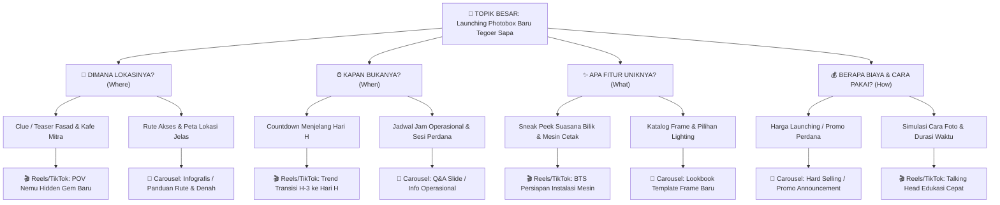
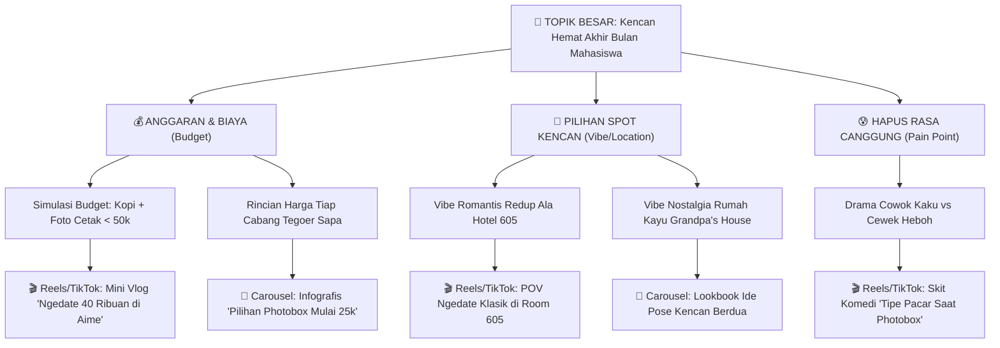
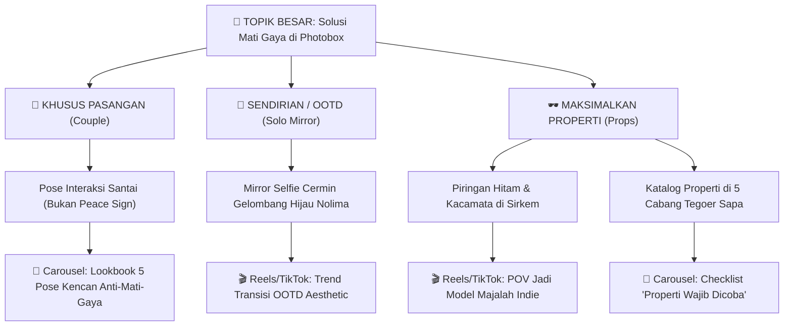

# Framework Brainstorming: Pohon Percabangan Ide (Idea Branching Tree)

Framework ini digunakan ketika pengguna ingin memulai dari **Topik Besar / Tema Kampanye**, kemudian dipecah secara sistematis hingga menghasilkan rekomendasi tipe konten spesifik (Reels/TikTok vs Carousel).

---

## 🌳 Struktur 4 Tingkat Percabangan

```text
[Tingkat 1] Topik Besar / Tema Kampanye
   └── [Tingkat 2] Ranting Pertanyaan Kritis (5W + 1H Audiens)
          └── [Tingkat 3] Sudut Pandang / Angle Spesifik
                 └── [Tingkat 4] Rekomendasi Format Konten (Reels/TikTok vs Carousel Feed)
```

---

## 🧭 Panduan Matriks Keputusan Format Konten

| Karakteristik Kebutuhan Pesan | Format Paling Efektif | Alasan & Karakteristik |
|---|---|---|
| Membangun rasa penasaran (*curiosity*), emosi, atmosfer visual bergerak | **Video Pendek (Reels/TikTok)** | Menggunakan hook 3 detik, transisi, atau format POV/BTS untuk retensi tontonan tinggi. |
| Informasi padat, panduan rute/peta, perbandingan fitur, daftar harga | **Carousel Feed** | Mudah di-*swipe* berulang kali, memiliki tingkat penyimpanan (*save rate*) tinggi untuk dibaca ulang. |
| Pengumuman tanggal mendesak, promo flash diskon satu hari | **Single Post Feed / Story** | Pesan visual tunggal yang lugas (*hard selling*). |

---

## 📌 Studi Kasus 1: "Launching Photobox Baru Tegoer Sapa"



---

## 📌 Studi Kasus 2: "Kencan Hemat Akhir Bulan Mahasiswa Banjarbaru"



---

## 📌 Studi Kasus 3: "Solusi Mati Gaya di Photobox (Anti-Kaku)"



---

## 🚀 Alur Setelah Pohon Cabang Ditampilkan (Approval & Dual Brief)

1. **User Memilih Ranting**: Pengguna memilih cabang/ranting yang paling cocok dengan strategi saat itu (misal: *"Pilih Ranting P_COUPLE: Lookbook Pose Kencan"*).
2. **Validasi Persetujuan**: Pengguna menyatakan *"Sah"*, *"Bungkus"*, atau memberikan catatan revisi kecil.
3. **Output Ekspor Otomatis**: AI langsung menghasilkan 2 format brief kerja:
   - **Brief Tim Konten**: Lengkap dengan shotlist visual, instruksi grafis, hook 3-lapis, dan kata kunci SEO Banjarbaru.
   - **Brief KOL/Influencer**: Teks pesan WhatsApp ramah siap copy-paste langsung ke talent/kreator (detail lokasi kafe, skenario video, benefit ngopi/foto, dan 3 deliverables wajib: 1 Reels + 3 IG Stories).
   - **Tabel Ringkasan Ekspor**: Siap disalin ke Google Docs / Notion.
