# Framework Brainstorming: Pohon Percabangan Ide Twin-Track (Format Video & Desain Feed/Carousel)

Dokumen ini memandu AI Content Strategist untuk membedah **Satu Topik Besar / Tema Kampanye** menjadi **Pohon Percabangan Berakar Dalam dengan Format Ganda Wajib (Twin-Track Format)**: Setiap sudut pandang ide dipecah menjadi **(1) Format Video (Reels/TikTok)** dan **(2) Format Desain Feed / Carousel (Instagram)**.

---

## 🌳 Arsitektur Pohon Percabangan Format Ganda (Twin-Track Architecture)

Setiap ranting ide tidak boleh hanya condong ke satu format. Di tingkat eksekusi, setiap sub-topik **wajib membelah menjadi 2 cabang anak sejajar**:

```text
[Tier 1] TOPIK BESAR / TEMA KAMPANYE
   │
   ├── [Tier 2] 4 KLUSTER MAKRO (Persona, Cabang, Anti-Friksi, Momen Lokal)
   │
   ├── [Tier 3] SUB-KLUSTER SITUASI NYATA (Micro-Moments di Lapangan)
   │
   ├── [Tier 4] ANGLE PSIKOLOGIS & TRIGGER EMOSI
   │
   └── [Tier 5 & 6] PERCABANGAN GANDA EKSEKUSI (Bifurkasi Twin-Track):
         ├── 🎬 [Kode-V] FORMAT VIDEO (Reels / TikTok 9:16)
         │     ├── Tipe: POV / Talking Head / Skit Komedi / Mini Vlog / Transisi
         │     ├── Hook 3 Detik: Aksi Kamera + Text Overlay Kontras + SFX/Audio Tren
         │     └── Target KPI: Viral Reach, Video Views, Engagement (Shares)
         │
         └── 📑 [Kode-D] FORMAT DESAIN FEED (Carousel / Multi-Slide 4:5)
               ├── Tipe: Pose Cheat Sheet / Lookbook / Infografis Rincian / Meme Slide
               ├── Headline Slide 1: Scroll-Stopping Cover + Badge "📌 Simpan Buat Weekend"
               ├── Blueprint 7-Slide: Agitasi ➔ Solusi ➔ Bukti Fisik Cetak ➔ Clear CTA
               └── Target KPI: Saves (Bookmark), Trust, Direct Conversion (Kunjungan)
```

---

## 📌 Studi Kasus Komprehensif: "Kencan Santai, Hemat & Anti-Canggung di Banjarbaru"

Berikut adalah diagram pohon percabangan Mermaid yang secara sistematis membagi setiap sub-topik menjadi **2 cabang eksekusi (Video & Desain Feed)**:

```mermaid
graph TD
    ROOT["🎯 TOPIK: Kencan Santai, Hemat & Anti-Canggung di Banjarbaru"]

    %% TIER 2: 4 KLUSTER UTAMA
    ROOT --> C_PERSONA["👥 KLUSTER A: DINAMIKA PERSONA & RELASI"]
    ROOT --> C_BRANCH["🏠 KLUSTER B: CABANG & FITUR IKONIK"]
    ROOT --> C_FRICTION["⚠️ KLUSTER C: PERUNTUH FRIKSI & KERESAHAN"]
    ROOT --> C_MOMENT["⏰ KLUSTER D: PEMICU MOMEN & KALENDER LOKAL"]

    %% KLUSTER A: PERSONA
    C_PERSONA --> A1_SUB["Sub-Topik A1: Cowok Kaku Anti Gaya 2 Jari"]
    A1_SUB --> A1_V["🎬 [A1-V] Reels: Talking Head Tutorial Pose<br>Hook: 'Cowok kamu kaku kayak papan? Coba 3 trik ini'<br>Goal: Saves & Reach"]
    A1_SUB --> A1_D["📑 [A1-D] Carousel: Cheat Sheet 4 Pose Cowok Natural<br>Cover: 'Panduan Pose Cowok Anti Kaku di Photobox'<br>Goal: Saves & Share"]

    C_PERSONA --> A2_SUB["Sub-Topik A2: Drama Pasangan Baru / First Date"]
    A2_SUB --> A2_V["🎬 [A2-V] Reels: Skit Komedi Pasangan Mager<br>Hook: 'POV cowok yang mager difoto pas masuk malah heboh'<br>Goal: Shares & Viral"]
    A2_SUB --> A2_D["📑 [A2-D] Carousel: Infografis First Date Anti Krik-Krik<br>Cover: 'Kenapa First Date di Photobox Lebih Aman dari Bioskop'<br>Goal: Consideration"]

    %% KLUSTER B: CABANG & FITUR IKONIK
    C_BRANCH --> B1_SUB["Sub-Topik B1: Spotlight Romantis Hotel Room 605 (Aime)"]
    B1_SUB --> B1_V["🎬 [B1-V] Reels: POV Sinematik Beralih Lampu Spotlight<br>Hook: 'Tombol rahasia di Kamar 605 bikin muka glowing'<br>Goal: Desire & FOMO"]
    B1_SUB --> B1_D["📑 [B1-D] Carousel: Guide Perbandingan Mode Lighting Aime<br>Cover: 'Bedanya Lampu Normal vs Spotlight di Room 605'<br>Goal: Saves & Education"]

    C_BRANCH --> B2_SUB["Sub-Topik B2: Nostalgia Vintage Grandpa's House (Hatara)"]
    B2_SUB --> B2_V["🎬 [B2-V] Reels: Mini Vlog Kencan Retro Jendela Krepyak<br>Hook: 'Ngedate vintage di rumah kayu klasik Banjarbaru'<br>Goal: Reach & Traffic"]
    B2_SUB --> B2_D["📑 [B2-D] Carousel: Lookbook OOTD Vintage & Frame Jago<br>Cover: 'Inspirasi OOTD Kencan Retro di Grandpa Hatara'<br>Goal: Brand Affinity"]

    %% KLUSTER C: PERUNTUH FRIKSI & BIAYA
    C_FRICTION --> C1_SUB["Sub-Topik C1: Takut Mahal / Dompet Tipis"]
    C1_SUB --> C1_V["🎬 [C1-V] Reels: Vlog Bukti 'Kencan 40 Ribuan Dapet Foto'<br>Hook: 'Ngedate modal 20 ribuan per orang emang bisa?'<br>Goal: Conversion"]
    C1_SUB --> C1_D["📑 [C1-D] Carousel: Infografis Rincian Biaya Simulasi Kencan<br>Cover: 'Breakdown Ngedate <50k di Banjarbaru: Kopi + Foto'<br>Goal: Saves & Action"]

    C_FRICTION --> C2_SUB["Sub-Topik C2: Panik Timer 10 Detik vs Retake Sepuasnya"]
    C2_SUB --> C2_V["🎬 [C2-V] Reels: Edukasi Cepat Trik Layar di Kean Coffee<br>Hook: 'Gak usah panik timer! Bilik ini bisa retake sepuasnya'<br>Goal: Trust"]
    C2_SUB --> C2_D["📑 [C2-D] Carousel: Checklist Anti Panik Saat Masuk Bilik<br>Cover: '3 Langkah Tenang Pas Timer Photobox Mulai Jalan'<br>Goal: Saves & Education"]

    %% KLUSTER D: PEMICU MOMEN & KALENDER LOKAL
    C_MOMENT --> D1_SUB["Sub-Topik D1: Rundown Kencan Malam Minggu"]
    D1_SUB --> D1_V["🎬 [D1-V] Reels: Transisi OOTD Malam Minggu OTW Photobox<br>Hook: 'Rencana malam minggu ini: Ngopi santai lalu foto'<br>Goal: Traffic"]
    D1_SUB --> D1_D["📑 [D1-D] Carousel: Guide Rundown Itinerary Kencan Banjarbaru<br>Cover: 'Rundown Kencan Malam Minggu Banjarbaru Anti Bosan'<br>Goal: Saves & Guide"]

    C_MOMENT --> D2_SUB["Sub-Topik D2: Hujan Sore Syahdu di Banjarbaru"]
    D2_SUB --> D2_V["🎬 [D2-V] Reels: Atmospheric Aesthetic Mood Hujan & Bilik Foto<br>Hook: 'Tempat neduh paling romantis pas hujan deras sore'<br>Goal: Shares & Viral"]
    D2_SUB --> D2_D["📑 [D2-D] Carousel: Curated List Spot Kafe Neduh Hujan<br>Cover: 'Melipir Neduh: 5 Kafe Photobox Syahdu di Banjarbaru'<br>Goal: Saves & Community"]
```



---

## 📋 Menu Ringkasan Kode Ranting Format Ganda (Twin-Track Quick Selection Menu)

Di bawah diagram Mermaid, AI **wajib menyajikan tabel berpasangan** ini agar pengguna dapat dengan mudah memilih:
1. Ingin mengeksekusi **Format Video saja (`-V`)**,
2. Ingin mengeksekusi **Format Desain Feed saja (`-D`)**,
3. Atau ingin mengeksekusi **Sepaket Sekaligus (Video + Desain Feed)**!

| Sub-Topik / Angle Masalah | 🎬 Jalur Konten Video (Reels/TikTok) | 📑 Jalur Desain Feed (Carousel 4:5) | Pilar & Goal |
|---|---|---|---|
| **[A1] Cowok Kaku Anti Gaya 2 Jari** | **[A1-V]** Reels: Talking Head 3 Pose Cowok Simpel | **[A1-D]** Carousel: Cheat Sheet 4 Pose Grid Natural | Tutorial (*Saves*) |
| **[A2] Drama Pasangan / First Date** | **[A2-V]** Reels: Skit Komedi Cowok Mager Malah Heboh | **[A2-D]** Carousel: Infografis Alasan Photobox Aman Buat First Date | Hiburan / Edukasi (*Shares*) |
| **[B1] Spotlight Hotel Room 605 (Aime)** | **[B1-V]** Reels: POV Sinematik Mode Lampu Spotlight | **[B1-D]** Carousel: Perbandingan Visual Lampu Normal vs Spotlight | Inspirasi / Edukasi (*Desire*) |
| **[B2] Vintage Nostalgia Hatara** | **[B2-V]** Reels: Mini Vlog Kencan Jendela Krepyak | **[B2-D]** Carousel: Lookbook OOTD Retro & Frame Jago | Inspirasi (*Affinity*) |
| **[C1] Takut Mahal / Dompet Tipis** | **[C1-V]** Reels: Vlog Bukti Bayar Kencan 40 Ribuan | **[C1-D]** Carousel: Breakdown Rincian Biaya Kencan <Rp50k | Promosi (*Conversion*) |
| **[C2] Panik Timer vs Retake Sepuasnya** | **[C2-V]** Reels: Edukasi Trik Layar Retake Kean Coffee | **[C2-D]** Carousel: Step-by-Step Trik Anti Panik di Bilik | Edukasi (*Trust*) |
| **[D1] Rundown Kencan Malam Minggu** | **[D1-V]** Reels: Transisi OOTD Malam Minggu Berdua | **[D1-D]** Carousel: Itinerary 1 Hari Kencan Banjarbaru | Tutorial (*Saves*) |
| **[D2] Hujan Sore di Banjarbaru** | **[D2-V]** Reels: Video Mood Sinematik Neduh Pas Hujan | **[D2-D]** Carousel: Rekomendasi Spot Neduh & Foto Kafe | Hiburan (*Shares*) |

---

## 🎯 Panduan Interaksi & Cara Pengguna Memilih:

Pengguna memiliki fleksibilitas penuh untuk memilih:
- **Opsi 1 (Hanya Video)**: *"Aku pilih video [A1-V] dan [C1-V] ya!"* ➔ AI meracik Brief Tim Konten Video (Shotlist + Hook + Audio) dan Brief KOL.
- **Opsi 2 (Hanya Desain Feed)**: *"Buatin brief desain carousel [A1-D] dan [B1-D] ya!"* ➔ AI meracik Brief Desainer Grafis (Blueprint 7-Slide + Dimensi 4:5 + Palet Warna + Caption SEO).
- **Opsi 3 (Paket Lengkap Sepasang)**: *"Bungkus paket [A1] dan [C1] lengkap (Video + Desain Feed)!"* ➔ AI menghasilkan paket komplit untuk Video Editor dan Desainer Grafis sekaligus!
