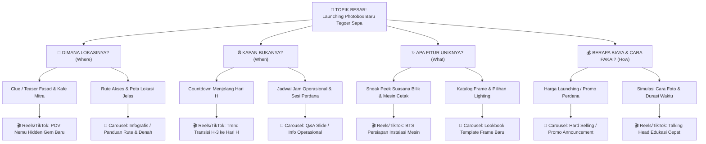

# Framework Brainstorming: Pohon Percabangan Ide (Idea Branching Tree)

Framework ini digunakan ketika pengguna ingin memulai dari **Topik Besar / Tema Kampanye**, kemudian dipecah secara sistematis hingga menghasilkan rekomendasi tipe konten spesifik (Reels/TikTok vs Carousel).

---

## 🌳 Struktur 4 Tingkat Percabangan

```text
[Tingkat 1] Topik Besar / Tema Kampanye
   └── [Tingkat 2] Ranting Pertanyaan Kritis (5W + 1H Audiens)
          └── [Tingkat 3] Sudut Pandang / Angle Spesifik
                 └── [Tingkat 4] Rekomendasi Format Konten (Reels/TikTok vs Carousel Feed)
```

---

## 🧭 Panduan Matriks Keputusan Format Konten

| Karakteristik Kebutuhan Pesan | Format Paling Efektif | Alasan & Karakteristik |
|---|---|---|
| Membangun rasa penasaran (*curiosity*), emosi, atmosfer visual bergerak | **Video Pendek (Reels/TikTok)** | Menggunakan hook 3 detik, transisi, atau format POV/BTS untuk retensi tontonan tinggi. |
| Informasi padat, panduan rute/peta, perbandingan fitur, daftar harga | **Carousel Feed** | Mudah di-*swipe* berulang kali, memiliki tingkat penyimpanan (*save rate*) tinggi untuk dibaca ulang. |
| Pengumuman tanggal mendesak, promo flash diskon satu hari | **Single Post Feed / Story** | Pesan visual tunggal yang lugas (*hard selling*). |

---

## 📌 Studi Kasus: "Launching Photobox Baru Tegoer Sapa"


