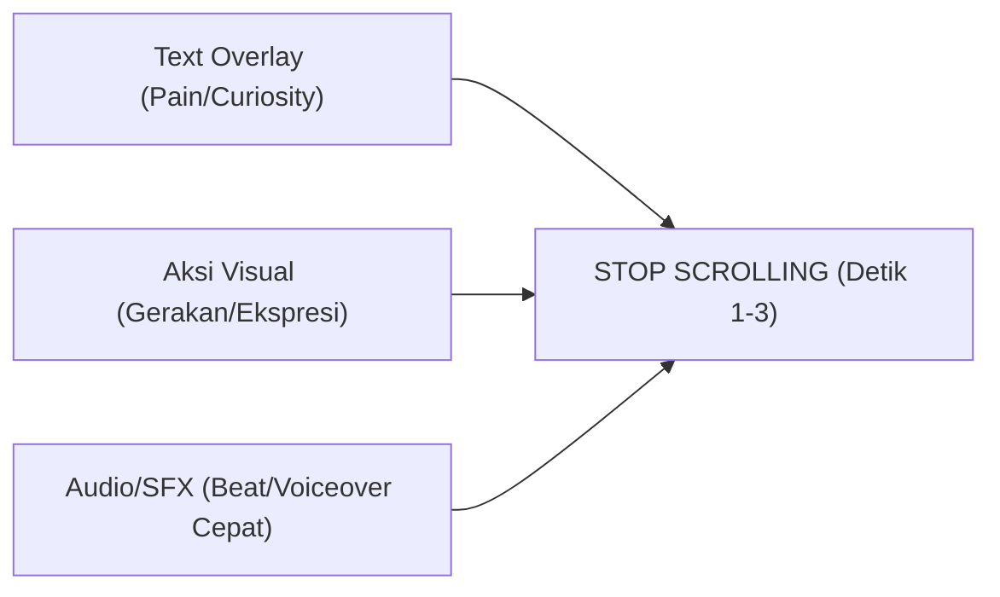

# ⚡ Playbook Copywriting & Strategi Konten Gen Z
### Psikologi "Bullshit Detector", Lo-Fi Authenticity, Unhinged Marketing & Social Search Playbook

Dokumen ini adalah pedoman strategis dan operasional untuk merancang copywriting dan konsep konten media sosial (TikTok, Instagram Reels, Carousel) yang secara alami **diterima, dibagikan, dan dipercayai oleh audiens Gen Z** (khususnya mahasiswa, pasangan muda, dan circle pertemanan di Banjarbaru).

---

## 🧠 1. Anatomi Pikiran Gen Z: Mengapa Konten Tradisional Gagal?

Gen Z adalah generasi *digital native* pertama yang tumbuh di tengah banjir paparan ribuan iklan setiap hari. Akibatnya, mereka mengembangkan sistem filter kognitif yang sangat ketat:

### A. The "Bullshit Detector" & Alergi Hard Selling
- **Penyebab Drop Retensi**: Gen Z langsung melakukan *swipe away* jika dalam 2 detik pertama mereka mencium aroma "iklan korporat", sales pitch kaku, atau klaim berlebihan (*"Photobox terbaik dan terlengkap!"*).
- **Kunci Penetrasi**: Gunakan pendekatan **Anti-Ad** atau **Soft-Narrative**. Brand harus hadir sebagai *teman sebaya* yang merekomendasikan hal seru, bukan perusahaan yang sedang jualan.

### B. Lo-Fi Authenticity > Hi-Fi Production
- Video beresolusi studio 4K yang terlalu mulus, pencahayaan panggung kaku, dan color grading berlebihan justru sering dianggap sebagai "iklan bersponsor" dan diabaikan.
- **Lo-Fi Power**: Video vertikal 9:16 yang direkam menggunakan kamera ponsel biasa, pencahayaan alami bilik, gerakan kamera *handheld*, dan ekspresi *candid/raw* memiliki engagement dan tingkat kepercayaan (trust score) hingga **3x lipat lebih tinggi**.

### C. Identity Signaling & Social Currency
- Gen Z membagikan konten (*Share*) bukan untuk membantu brand menjadi viral, melainkan untuk **memperlihatkan identitas mereka sendiri** kepada teman-temannya:
  - *"Ini gue banget pas diajak foto"* $\rightarrow$ Menunjukkan kepribadian lucu/relatable.
  - *"Tempat nongkrong ini estetik parah"* $\rightarrow$ Menunjukkan selera visual yang bagus (*curated taste*).
  - *"Besok kita harus coba ini"* $\rightarrow$ Menunjukkan inisiatif dalam pertemanan.

### D. Value Density (Kepadatan Nilai) & Rentang Mikro-Atensi
- Gen Z tidak memiliki rentang perhatian pendek, melainkan **standar filter yang sangat cepat** (1,5 – 3 detik).
- Setelah hook berhasil menghentikan jari mereka, konten wajib menyajikan stimulasi visual atau informasi baru setiap **3–4 detik** (*pacing dinamis, jump-cut, pergantian sudut kamera*) agar tidak terjadi drop-off di pertengahan video.

---

## ✍️ 2. Aturan Emas Copywriting Gen Z

### A. Prinsip "Mirroring" vs "Forced Slang" (Anti-Cringe)
Kesalahan terbesar brand tua saat menargetkan Gen Z adalah menjejalkan kata gaul internet secara berlebihan sehingga terkesan memaksakan diri (*cringe / trying too hard*).

| Aspek | ❌ Hindari (Forced & Cringe) | ✅ Gunakan (Natural Mirroring) |
|---|---|---|
| **Pilihan Kata** | *"Halo bestie gaskeun ya ygy kuy foto aesthetic slebew"* | *"Capek banget gak sih pas dandan udah sejam tapi ujungnya mati gaya di depan kamera?"* |
| **Panggilan** | *"Kakak-kakak kece"* atau *"Sobat Tegoer"* | *"Bestie"*, sudut pandang *"Aku - Kamu"*, atau langsung ke kata ganti persona (*"anak UIN", "kaum introvert"*). |
| **Struktur** | Paragraf panjang bertumpuk, kalimat majemuk formal | Kalimat pendek, tajam, ritmis, dipisah per 1 baris. |

### B. Natural Code-Mixing & Internet Slanguage
Gunakan istilah slang internet yang sudah menjadi bahasa alami percakapan sehari-hari tanpa terkesan dipaksakan:
- **Validasi & Perasaan**: *Jujurly, relate banget, overthinking, mati gaya, salting, red flag vs green flag, lowkey, heboh sendiri.*
- **Konteks & Vibe**: *Vibes-nya dapet, spot ngedate hemat, hidden gem, aesthetics, lookbook, bilik privat.*
- **Humor & Ironi**: *Definisi, endingnya malah..., plot twist, capek banget, realita vs ekspektasi.*

---

## 🪝 3. 6 Formula Hook Scroll-Stopping Gen Z (Detik 0:00 - 0:03)

Wajib menyatukan **3 elemen simultan**: Teks di layar (*Text Overlay Bold*), Aksi Visual Dinamis (*Visual Hook*), dan Audio/Voiceover yang padu.



### 1. The Relatable Callout (Menembak Keresahan Spesifik)
Menembak satu tipe orang atau kebiasaan konyol yang pasti pernah dialami audiens.
- *"Stop scrolling kalau tiap diajak foto kamu selalu bingung tangannya harus ditaruh di mana."*
- *"POV: Tipe-tipe orang pas hitungan mundur photobox udah mulai jalan (kamu nomor berapa?)."*

### 2. The Contrarian / Pattern Interrupt (Melawan Arus)
Menyatakan hal yang bertolak belakang dengan kebiasaan umum untuk memicu rasa kaget.
- *"Jangan pernah ajak cowok kamu photobox di sini kalau kamu gak mau dia ketagihan foto."*
- *"Tolong jangan masuk bilik Room 605 kalau gaya foto kamu masih pose dua jari begini..."*

### 3. The Knowledge Gap / Secret Hack (Rasa Penasaran Tertutup)
Membuka informasi rahasia yang terkesan eksklusif hanya untuk orang yang "in-the-know".
- *"Ternyata cuma 5% orang yang tahu fungsi tombol rahasia di Warkop Sirkem ini..."*
- *"Rahasia dapet lighting ala studio pro modal 25 ribu di Banjarbaru."*

### 4. The "Unfiltered" Confession (Curhat Spontan)
Membuka konten dengan nada curhat jujur seolah-olah sedang berbicara santai di story pribadi.
- *"Jujurly agak nyesel baru tahu kalau bilik foto di Kean Coffee bisa retake sepuasnya..."*
- *"Gak nyangka niatnya cuma mau ngopi santai di Hatara, pulangnya malah bawa kenangan se-lucu ini."*

### 5. The Situation POV (Point-of-View Kencan & Bestie)
Menempatkan audiens langsung ke dalam situasi emosional tertentu.
- *"POV: Maksa cowok kamu masuk photobox, endingnya dia yang paling heboh milih frame."*
- *"POV: Ngedate hemat akhir bulan di Banjarbaru yang hasilnya tetap kelihatan mahal."*

### 6. The Visual / Silent Hook (Tanpa Kata-Kata)
Memanfaatkan visual satisfying atau ekspresi wajah tanpa banyak bicara.
- *Visual*: Tangan melempar tumpukan cetakan foto beraneka frame ke atas meja kafe dengan suara ketukan meja renyah (*ASMR snap*).
- *Teks Layar*: *"Rate hasil photobox kita dari 1-10 📸👇"*

---

## 🎬 4. Format Konten Pemenang Gen Z (Winning Formats 2025–2026)

### A. "Unhinged / Chaotic Good" Marketing
Pendekatan di mana brand memposisikan dirinya bukan sebagai institusi kaku, melainkan sebagai **admin tongkrongan yang sedikit absurd dan jujur**.
- **Penerapan di Tegoer Sapa**:
  - Konten menertawakan kelakuan tim/admin sendiri: *"Cobain semua gaya foto aneh yang pernah ditinggal pengunjung di bilik foto."*
  - Membalas komentar audiens dengan video candaan santai menggunakan template meme yang sedang viral di TikTok.
  - Tidak defensif saat ada komplain kecil, melainkan merespons dengan humor ramah dan solusi langsung.

### B. Silent Review & Visual ASMR
Tren di mana talent/kreator tidak berbicara sama sekali (*zero voiceover*), membiarkan visual dan audio alami yang berbicara.
- **Penerapan di Tegoer Sapa**:
  - Talent masuk bilik, memegang properti kacamata hitam, memberi jempol/ekspresi mengangguk.
  - Menonjolkan suara ambient: suara tirai marun digeser, tombol saklar lampu diklik (*klik-klak*), ketukan jari di layar sentuh, dan suara mekanik printer saat kertas foto keluar.
  - Format ini memberi relaksasi dari kebisingan media sosial, sehingga penonton bertahan menonton hingga detik terakhir (*completion rate tinggi*).

### C. Photo Dump Carousel (Lo-Fi Feed Storytelling)
Instagram Feed & TikTok Photo Mode yang menggabungkan estetika foto kasual dengan cerita emosional.
- **Slide 1**: Foto hasil cetak di samping cangkir kopi dengan headline menggelitik (*"Kencan 30 ribu tapi memorinya seumur hidup"*).
- **Slide 2**: Foto candid candid canggung pas di dalam bilik.
- **Slide 3**: Foto zoom-in detail frame vintage koran / mangkok ayam jago.
- **Slide 4**: Mirror selfie di cermin cembung/wavy mirror luar boks.
- **Slide 5**: Meme penutup atau ajakan santai (*"Weekend besok giliran siapa yang bayarin photobox?"*).

### D. Lo-Fi Behind-The-Scenes (BTS) & "Yap" Content
Konten monolog santai sambil beraktivitas nyata di kafe/bilik foto.
- Talent membersihkan kaca bilik sambil bercerita santai: *"Hal paling random yang pernah ketinggalan di photobox Tegoer Sapa... mulai dari kunci motor sampai cincin tunangan 😭"*.

---

## 🚀 5. Rumus Call-to-Action (CTA) Anti-Paksaan

Gen Z memiliki resistensi tinggi terhadap perintah eksplisit (*"Beli sekarang", "Kunjungi toko kami"*). Ganti dengan **CTA berbasis interaksi sosial dan keuntungan pribadi**:

```text
[Tujuan Algoritma] ➔ [Pendekatan Konvensional (❌ Kaku)] ➔ [Pendekatan Gen Z Native (✅ Efektif)]
```

| Metrik Algoritma | ❌ Hindari (Kaku / Salesy) | ✅ Gunakan (Gen Z Native) |
|---|---|---|
| **Saves (Nilai Tinggi)** | *"Simpan postingan ini sekarang juga!"* | *"Save dulu biar gak bingung pas ditanya doi mau kencan ke mana."* |
| **Shares (Viralitas Utama)** | *"Bagikan video ini ke teman-temanmu!"* | *"Kirim ke bestie kamu yang kalau foto ekspresinya gak pernah berubah 😭"* |
| **Comments (Engagement)** | *"Tulis pendapatmu di bawah!"* | *"Kamu tim frame vintage koran atau frame ayam jago klasik? Drop di komen!"* |
| **Foot Traffic (Kunjungan)** | *"Ayo datang ke cabang kami di Jalan X!"* | *"Weekend ini udah tau kan mau ngopi di mana? Lokasinya di bio ya."* |

---

## 🔍 6. Social Search SEO untuk Gen Z

Gen Z menggunakan kolom pencarian TikTok & Instagram sebagai search engine utama untuk mencari rekomendasi tempat nongkrong, kafe, dan spot foto.

### Cara Mengoptimalkan Social Search:
1. **On-Screen Text Kunci**: Pastikan kata kunci spesifik tertulis tebal di 3 detik pertama (misal: `photobox banjarbaru`, `spot foto banjarbaru`, `kafe estetik banjarbaru`).
2. **Audio-Transcription Match**: Ucapkan kata kunci tersebut di voiceover pada 5 detik pertama agar algoritma audio-to-text TikTok membaca topik video dengan akurat.
3. **Caption 2 Baris Pertama**: Masukkan kalimat kontekstual yang mengandung kata kunci sebelum tombol `...more`:
   > *"Rekomendasi spot photobox banjarbaru yang privat dan gak bikin mati gaya di Kean Coffee..."*

---

## 📋 7. Matriks Naskah Praktis per Cabang Tegoer Sapa

### Template Cabang 1: Grandpa's House (Hatara Coffee)
- **Angle**: Anti-Antre & Jendela Kayu Interaktif (POV Hangout Santai)
- **Hook (0-3s)**:
  - *Visual*: Talent duduk santai menyeruput kopi sambil melihat QR antrean di HP.
  - *Teks*: *"POV: Photobox di kafe tapi gak perlu pegel antre berdiri"*
  - *VO*: *"Nongkrong di Hatara tuh paling santai, bisa photobox tanpa drama antre..."*
- **Body (4-10s)**:
  - *Visual*: Nomor antrean dipanggil, talent jalan santai ke rumah kayu vintage, buka jendela krepyak kayu dan foto dengan pose cilukba dari luar ke dalam.
  - *Teks*: *"Bisa foto lewat jendela kayu gini lagi!"*
- **CTA (11-15s)**:
  - *Visual*: Hasil cetak frame ayam jago klasik ditunjukkan ke kamera.
  - *Teks*: *"Save dulu buat referensi nongkrong sore ini bareng circle kamu ☕📸"*

### Template Cabang 2: Hotel Room 605 (Aime Coffee)
- **Angle**: Lampu Spotlight Studio & Bilik Privat Anti-Malu
- **Hook (0-3s)**:
  - *Visual*: Tangan membuka pintu kamar bernomor 605, lampu spotlight dinyalakan dengan efek transisi tajam.
  - *Teks*: *"Bilik foto di Banjarbaru yang vibes-nya kayak kamar hotel rahasia 🚪✨"*
- **Body (4-10s)**:
  - *Visual*: Menaruh tas ransel di rak khusus dalam bilik, ganti mode lampu ke Spotlight, hasil wajah langsung glowing tanpa bayangan kusam.
  - *Teks*: *"Ada rak tas + switch lampu studio bikin kulit auto mulus"*
- **CTA (11-15s)**:
  - *Visual*: Mirror selfie di dalam bilik sambil pegang hasil cetak frame kalender.
  - *Teks*: *"Mulai 25 ribu aja! Tag doi yang hobi mirror selfie 🫶"*

### Template Cabang 3: Kean Coffee Branch
- **Angle**: Fitur Retake Sepuasnya (Solusi Mati Gaya)
- **Hook (0-3s)**:
  - *Visual*: Ekspresi panik talent pas hitungan mundur foto selesai, lalu tiba-tiba tersenyum lega menekan tombol retake.
  - *Teks*: *"Buat kamu yang selalu gagal di take pertama: ini penyelamatmu"*
- **Body (4-10s)**:
  - *Visual*: Menunjukkan timer 5 menit di layar dan tombol retake ditekan berkali-kali sampai dapat pose terbaik di bawah bola disko.
  - *Teks*: *"Bebas ulang foto sepuasnya selama 5 menit + bayar scan QRIS langsung di layar"*
- **CTA (11-15s)**:
  - *Visual*: Tirai marun ditutup kembali, menunjukkan 2 strip foto hasil cetakan.
  - *Teks*: *"Kirim ke teman kamu yang butuh 10x retake baru puas fotonya 😭"*
