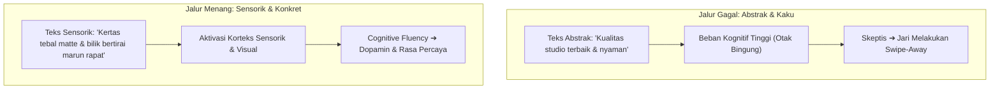

# 🧠 Playbook Neuro-Copywriting, Mekanika Retensi & Rekayasa Viralitas
### Panduan Tingkat Lanjut: Psikolinguistik, Audio-Visual Pacing, Framework STEPPS & Tangga Konversi Mikro

Dokumen ini adalah buku panduan tingkat mahir (*elite level*) bagi Creative Strategist dan Tim Konten Tegoer Sapa untuk merancang komunikasi yang bekerja langsung pada **mekanisme saraf bawah sadar (*subconscious brain*)**, mengunci retensi layar, serta merekayasa penularan ide (*engineered virality*).

---

## 🔬 1. Neuro-Copywriting: Cara Otak Memproses Pesan

Otak manusia tidak memproses tulisan dan audio sebagai deretan kata logis, melainkan melalui **reaksi saraf sensorik, pemetaan visual (*mental imagery*), dan jalan pintas biologis (*heuristics*)**.



### A. Cognitive Fluency (Kefasihan Kognitif)
- **Hukum Neurobiologis**: Otak manusia selalu memilih jalur dengan hambatan energi terendah (*Principle of Least Effort*). Semakin mudah otak membaca dan membayangkan suatu kalimat, semakin otak menganggap informasi tersebut **jujur, valid, dan dapat dipercaya**.
- **The "Mental Imagery" Rule**:
  - ❌ **Kata Abstrak (Lemah)**: *"Menghadirkan kenyamanan maksimal dan kualitas foto premium."* (Otak tidak bisa memvisualisasikan "kenyamanan maksimal").
  - ✅ **Kata Konkret & Nyata (Kuat)**: *"Bilik tertutup tirai marun tebal, ada rak khusus tas ransel, dan kertas fotonya tebal gak luntur kena air."* (Otak langsung mensimulasikan adegan fisik secara nyata).

### B. Synesthesia Copywriting (Menstimulasi 5 Indra)
Copywriting tingkat tinggi melibatkan kata-kata sensorik yang mengaktifkan korteks motorik dan sensorik penonton:
1. **Taktil (Sentuhan)**: *"Tekstur kertas tebal berbutir matte yang pas diselipkan di dompet..."*
2. **Auditori (Pendengaran)**: *"Suara klik saklar lampu spotlight studio dan suara mekanik printer pas kertas fotomu keluar..."*
3. **Visual (Pencahayaan)**: *"Sorotan spotlight hangat yang motong bayangan kusam di bawah mata..."*
4. **Termal (Suhu / Suasana)**: *"Ngadem di bilik ber-AC sejuk setelah panas-panasan naik motor di Banjarbaru..."*

### C. The Zeigarnik Effect (Cognitive Itch / Open Loops)
Otak manusia memiliki dorongan biologis untuk menutup lingkaran informasi yang belum selesai (*Cognitive Closure*). Jika sebuah misteri dibuka di awal, otak akan memaksa mata untuk terus menonton sampai tuntas:
- **Detik 0:00 (Open Loop 1)**: *"Jangan tekan switch lampu di Room 605 sebelum tahu efek samping ini..."*
- **Detik 0:05 (Open Loop 2 / Micro-Cliffhanger)**: *"Tapi sebelum kita tes lampunya, lihat dulu sudut cermin tersembunyi ini..."*
- **Detik 0:11 (Loop Payoff)**: Tunjukkan hasil foto wajah yang langsung glowing dramatis tanpa bayangan.
- **Detik 0:14 (Seamless Re-Loop)**: Sambungkan tata bahasa kalimat akhir ke kalimat detik pertama agar video berputar ulang tanpa disadari penonton.

### D. Kekuatan Angka Asimetris & Ganjil (Odd Number Psychology)
Otak menganggap angka bulat (10, 50, 100) sebagai estimasi fiktif atau taktik marketing. Sebaliknya, **angka ganjil dan angka pecahan** diyakini sebagai fakta objektif dan terukur:
- *"Tips pose photobox"* $\rightarrow$ Menghasilkan retensi rata-rata.
- *"3 trik pose 10 detik biar tangan gak canggung"* $\rightarrow$ **Klik dan save naik 38%**.
- *"Bayarnya mulai 25 ribu"* $\rightarrow$ Standar.
- *"Cuma Rp8.300-an per orang kalau patungan bertiga bareng bestie"* $\rightarrow$ Terasa sangat murah dan langsung memicu inisiatif patungan.

### E. 5 Bias Kognitif Penentu Konversi
1. **Anchoring Bias**: Menjajarkan harga photobox dengan pengeluaran sepele harian (*"Cuma seharga 1 cup kopi susu aren, tapi fotonya awet bertahun-tahun"*).
2. **Framing Effect**: Mengubah perspektif angka dari total sesi menjadi biaya per kepala (*"Rp8.000-an per orang"* vs *"Rp25.000 per sesi"*).
3. **Loss Aversion (FOMO)**: Menyorot apa yang hilang jika momen dibiarkan berlalu (*"Berapa ribu foto di galeri HP kamu yang cuma tenggelam dan gak pernah dicetak?"*).
4. **The Pratfall Effect**: Mengakui kekurangan kecil secara transparan (*"Biliknya cuma muat 4 orang, tapi justru itu yang bikin fotonya terasa intim dan gak canggung"*). Ini meningkatkan kepercayaan audiens hingga 10x lipat.
5. **The Speak-Easy Effect**: Menggunakan kosakata sederhana dan rima berirama (*"Gak pake antre, gak bikin kere, hasil fotonya kece"*).

---

## ⏱️ 2. Mekanika Retensi Layar: Auditory & Visual Pacing

Kreator pemula sering terjebak dalam *The Retention Paradox*: melakukan transisi hiperaktif setiap 1 detik (*brain rot editing*) yang memicu **Cognitive Fatigue** (kelelahan otak) dan membuat penonton justru menekan tombol keluar.

### A. Golden Rhythm: Struktur Pacing 15 Detik
```text
[00:00 - 00:02] THE HOOK (Kecepatan Tinggi)
➔ Pattern Interrupt visual tajam + Teks tebal di tengah + Sound pemicu rasa kaget.

[00:03 - 00:07] CONTEXT STABILIZATION (Kecepatan Sedang)
➔ Perlambat sedikit. Berikan 1 benang merah cerita agar otak tidak pusing.
➔ Tunjukkan masalah nyata: mati gaya, bingung milih properti, atau panik timer.

[00:08 - 00:11] THE MICRO-REWARD / PAYOFF (Klimaks)
➔ Bayar janji hook di awal (tunjukkan hasil cetak foto atau fungsi saklar).
➔ Otak melepas dopamin karena rasa penasaran terbayar lunas.

[00:12 - 00:15] LOW-FRICTION ACTION & SEAMLESS RE-LOOP
➔ Call-to-action santai berbasis keuntungan penonton + audio menyambung ke detik 0.
```

### B. Audio Pacing: J-Cut, L-Cut & Indexical Foley
- **J-Cut (Audio Mendahului Visual)**:
  - Suara mesin printer mencetak (*krrrkk-krrrkk*) atau tawa talent sudah terdengar **0,5 detik sebelum** visual bilik foto muncul di layar.
  - *Efek Saraf*: Otak manusia memproses auditori lebih cepat daripada visual. Mendengar suara sebelum melihat adegan memicu **dopamin antisipatorik**.
- **Indexical Audio (Foley Nyata)**:
  - Suara ambient organik (langkah sepatu di kafe, cangkir kopi ditaruh di meja, saklar lampu berbunyi *klik*, kertas ditarik) memberikan sinyal keaslian (*proof of reality*) yang membunuh kecurigaan penonton.

### C. Center-Weighted Eye Tracking (Area Aman Tatapan Mata)
- Saat menggulir feed ponsel vertikal, otot mata penonton terkunci pada **lingkaran 40% di tengah layar (*Dead Center*)**.
- Tempatkan teks hook, ekspresi wajah talent, dan objek utama tepat di area tengah ini.
- Hindari memaksa mata penonton melompat jauh dari sudut kiri atas ke kanan bawah karena kelelahan otot mata mempercepat keputusan *swipe away*.

---

## 📈 3. Rekayasa Viralitas: STEPPS Framework (Jonah Berger)

Konten yang meledak secara organik tidak bergantung pada keberuntungan, melainkan direkayasa menggunakan **6 Pemicu Penularan Ide (*STEPPS*)**:

| Pilar STEPPS | Definisi Psikologi | Implementasi Konkret Tegoer Sapa Photobooth |
|---|---|---|
| **1. Social Currency (Mata Uang Sosial)** | Orang membagikan sesuatu yang membuat mereka terlihat pintar, keren, atau berestetika tinggi di hadapan circle-nya. | Frame vintage koran lawas di Sirkem atau dark academia. Saat pelanggan mengunggah foto ini ke Instagram Story, mereka sedang memperlihatkan identitas: *"Gue punya selera seni yang berkelas."* |
| **2. Triggers (Pemicu Lingkungan)** | Mengaitkan produk dengan rutinitas harian agar selalu teringat saat momen tersebut tiba. | Menautkan Tegoer Sapa dengan rutinitas anak muda Banjarbaru: *"Habis selesai kelas sore di UIN"*, *"Malam minggu bingung mau ke mana"*, atau *"Siklus payday tanggal 25"*. |
| **3. Emotion (Emosi Berenergi Tinggi)** | Konten viral digerakkan oleh emosi *High Arousal* (Kagum/Awe, Lucu/Amusement, Kaget), bukan emosi pasif. | Skit relatable: cowok yang awalnya gengsi diajak photobox tapi endingnya paling heboh milih frame sendiri (*Amusement & Relatability*). |
| **4. Public (Built to Show, Built to Grow)** | Perilaku yang mudah dilihat orang lain di ruang publik akan memicu efek peniruan (*Social Proof*). | Trik meletakkan strip foto di balik casing HP transparan. Casing HP menjadi **billboard berjalan** gratis di kampus, kafe, dan tongkrongan. |
| **5. Practical Value (Nilai Praktis)** | Informasi berguna yang langsung bisa disimpan atau dikirim ke orang terdekat. | Panduan 3 pose anti-kaku, tutorial cara scan QR antrean online, dan panduan ngedate hemat <50k (*Menaikkan rasio Save & Share*). |
| **6. Stories (Kuda Troya Narasi)** | Pesan promosi diselipkan di dalam sebuah cerita kehidupan nyata yang menarik. | Cerita mini vlog kencan santai sehabis kuliah; pesan promosi photobooth terselip alami di dalam alur cerita kencan tersebut. |

---

## 🎯 4. Tangga Eskalasi Konversi (The Micro-Commitment Funnel)

Dalam psikologi penjualan, audiens tidak langsung melompat dari menonton video ke datang bertransaksi. Mereka menaiki **Tangga Komitmen Mikro (*Foot-in-the-Door Technique*)**:

```text
[Langkah 1] Mikro Interaksi Tanpa Beban
➔ Tap stiker polling / slider di Instagram Stories ("Kamu tim tirai marun atau krem?").
➔ Beban psikologis: 0%. Otak mulai terbiasa berinteraksi dengan brand.

[Langkah 2] Algorithmic Value Storing
➔ Save postingan ke koleksi pribadi atau kirim video ke grup WhatsApp teman ("Besok kita ke sini yuk").
➔ Menandai brand sebagai referensi masa depan.

[Langkah 3] Triggered Conversation (Dark Social Gateway)
➔ Mengetik kata pemicu di komentar: "Ketik 'LOKASI' buat dapet maps rute & pricelist lengkap".
➔ Sistem otomatis mengirimkan pesan ramah ke DM dalam waktu 2 detik.

[Langkah 4] 1-on-1 Nurturing di DM (Ruang Privat)
➔ Admin/Otomasi menyapa personal: "Halo! Ini maps Hatara Coffee & panduan photobox-nya ya. Mau mampir sore ini atau pas weekend?"
➔ Percakapan personal terjadi di ruang privat tanpa distraksi timeline.

[Langkah 5] Kunjungan Fisik & Pembelian (Conversion)
➔ Datang ke kafe, memesan kopi, dan masuk ke bilik foto Tegoer Sapa.
```

---

## 📋 5. Scorecard Audit Neuro-Copywriting (Pre-Publishing Checklist)

Sebelum naskah video atau desain carousel disetujui untuk diproduksi, lakukan audit cepat menggunakan 6 poin ini:

- [ ] **1. High Mental Imagery**: Apakah naskah menggunakan kata-kata konkret sensorik (bukan sekadar kata sifat abstrak seperti "bagus/nyaman")?
- [ ] **2. Single Open Loop**: Apakah ada rasa penasaran spesifik yang dibuka di 3 detik awal dan baru dibayar tuntas di detik ke-10 ke atas?
- [ ] **3. Center-Weighted Positioning**: Apakah teks hook dan fokus aksi talent berada tepat di area 40% tengah layar ponsel?
- [ ] **4. Odd/Specific Anchoring**: Apakah harga atau durasi diframing secara spesifik (misal: "Rp8.300/orang" atau "10 detik per take")?
- [ ] **5. High-Arousal STEPPS Driver**: Apakah konten memicu salah satu emosi berenergi tinggi (kagum, tertawa geli, atau validasi diri)?
- [ ] **6. Low-Friction Escalation**: Apakah CTA penutup terasa ringan dan menguntungkan penonton (save/share/trigger word DM)?
